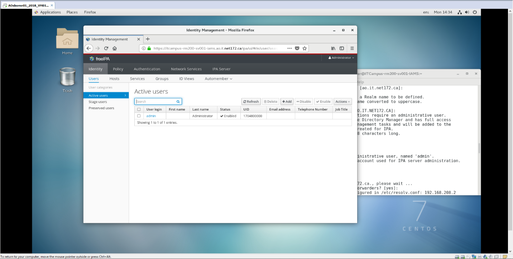
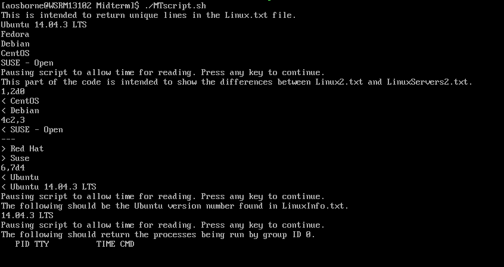
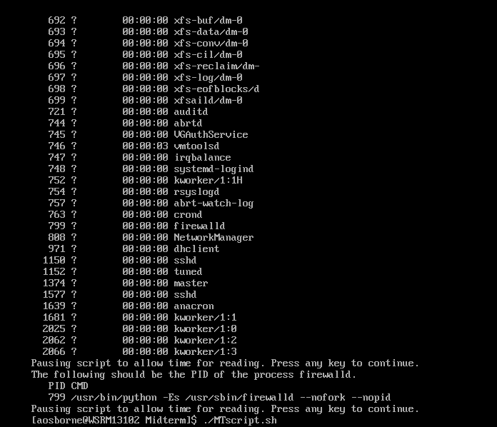
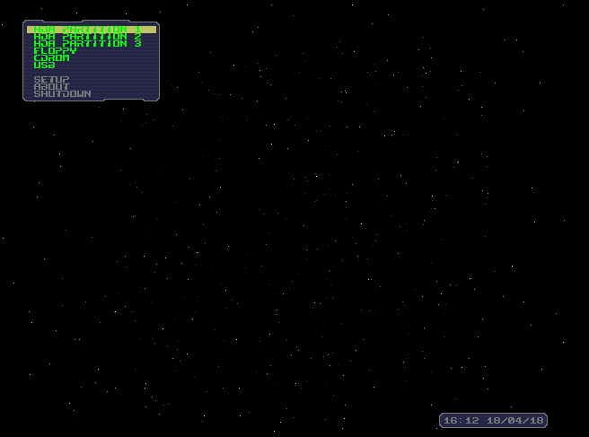
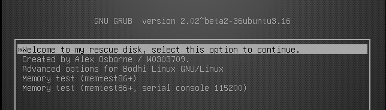
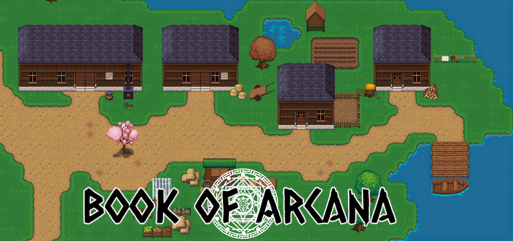
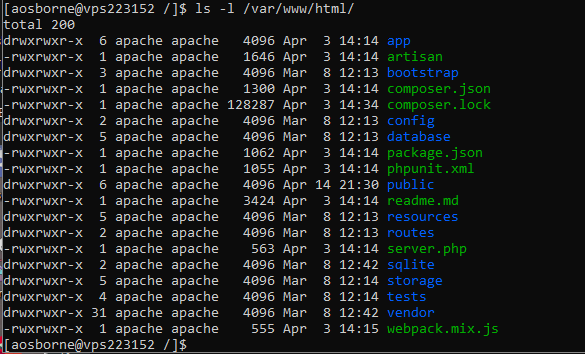

# Linux
A large part of my education, and my favorite part, revolved around working within the Linux environment. As such, I have experience with configuring and managing both personal and enterprise-level Linux environments, including the configuration of LDAP, DHCP, DNS, VPN, Firewalls and FreeIPA. 

I am also experienced with bash scripting and task automation using cronjobs. On this page you will find some samples of the Linux work I have completed.

## FreeIPA
An interesting contrast to Active Directory was the installation and configuration of FreeIPA for Identity Management. This was used to monitor and track users, groups and hosts on our domain. Found it very interesting to see somewhat of an Active Directory equivalent in a Linux environment.

(An image of my freeIPA Identity Management dashboard, showing the active users in the domain.) 

## Scripting
Scripting was a major asset and made me enjoy assignments like this immensely. I believe this assignment tasked us with creating a script that manipulated the text in some files and pulled some system information such as system version and process ids under a certain group. We were also required to include comments and pauses between each task within our script.

(Results from a script that manipulated text files, read the system version and grabbed processes being run by group ID 0.)

(Further results from the same script, showing process owned by group ID 0 and the PID of the firewalld process.)

## Rescue Disk
For the final of one of our Linux courses, I was tasked with the creation and configuration of a Linux rescue disk. As a part of the creation of this rescue disk, I modified a base install of Bodhi Linux with custom boot text, a custom background and pre-installation of the following software. Playing around with a bootloader like this was pretty unique among our assignments:

* memtest86+
* partimage
* chkrootkit
* chntpw
* mbuffer
* btrfs-tools

(An image of the bootloader used to mount the rescue disk.)

(A modified GRUB boot menu.)

## Capstone (Book of Arcana)
A large part of our final semester involved working with a team of individuals from multiple streams (programming, web development, systems) towards the creation of a 'product' of our choosing. I was a part of a team consisting of two programmers, two systems administrators and a web developer. As a part of this team, I helped with installing the required dependencies for both our game and web servers, our documentation, asset creation and user and file management on a remotely-hosted CentOS 7 server. If any of our members were having trouble with the server, we would help. As I hadn't yet worked in a live environment, I believe that having to help people with tasks like this was my first real introduction into the field.

(Banner image of a town within the game, along with the game logo.)

(An image of our web server's directory and permissions.)
