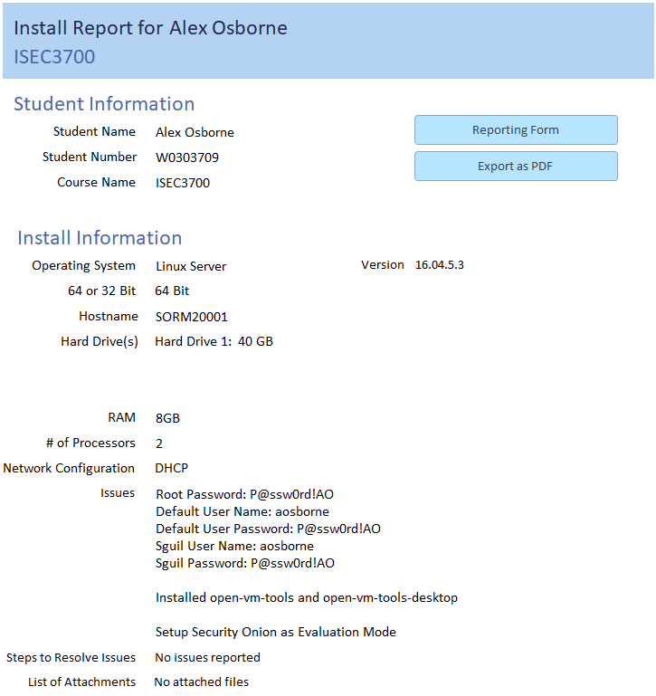

# Plans, Designs and Documentation
This section is a place for all of my miscellaneous work. Be it network designs, help desk plans, security documents or otherwise, it can all be found here.

## System Vulnerabilities
As a part of our security course in the first semester, we were tasked with using nmap to scan for open ports on nodes within our closed network. We then documented the ports that were open, their description, application PID and associated them with an executable running on the system. Finally, we researched and documented possible vulnerabilities related to these executables. I want to say that this was the first look we got at active network security.

(Several of the entries for our vulnerabilitity document, including open ports, port description and associated executable and vulnerabilities.)

## System Design
One of our courses revolved around designing and analyzing systems and networks, creating flowcharts, diagrams and documents for the creation of a new school and hospital network. We had also done some server rack diagrams and floor plans, though I picked this example in particular as I remember struggling with flowcharts.

(A cross-functional flowchart showing how different workflows from teachers, students and administration interacted with eachother.)

## Installation Logs
Almost every time we were required to create and configure a server, we would also be required to create a corresponding installation log with details on the server and changes made as part of the installation. It's been drilled into my head at this point that anything we do should be documented properly. Though I'll probably write the logs out manually next time.

(This is one of the more basic installation logs that I did during my time with the college. Includes my information, OS, architecture, etc.)
