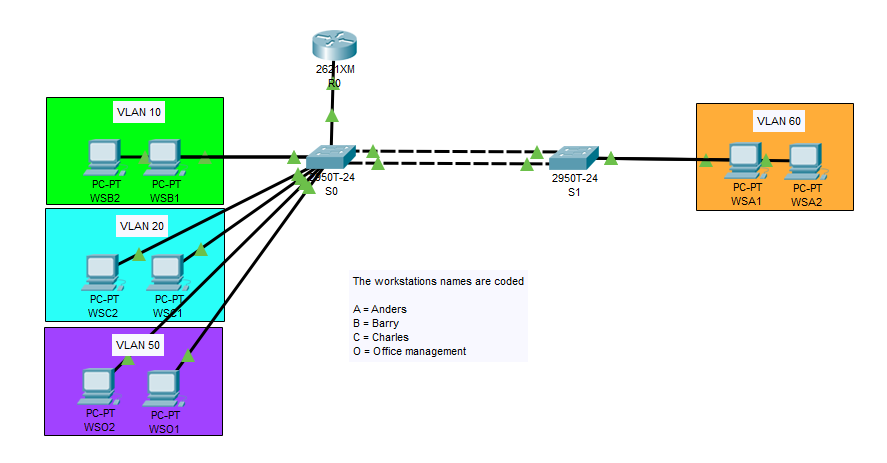
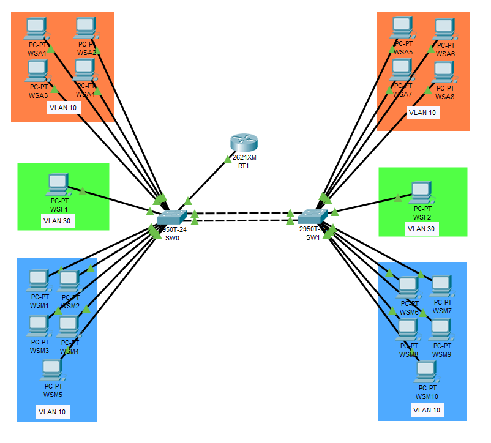
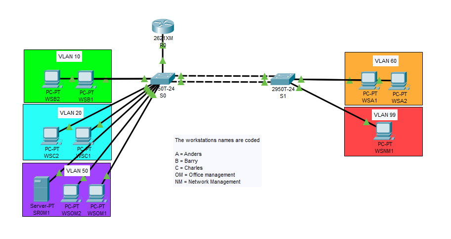

# Networking
Throughout my time with NSCC, I worked with small to enterprise-level networks in multiple environments. The most common environment for my work so far has been Packet Tracer. On this page you will find several samples of the work I have completed thus far.

## DHCP across VLANs
For this assignment we were required to configure a router as a DHCP server to distribute addresses to nodes across multiple VLANs. Having to create address pools and work with subinterfaces was a first for me and it is where I really began to enjoy working with IOS.

(Nodes on each VLAN received different addresses according to their respective VLANs.)

## Routing across a trunk
In this example I was tasked with the creation and configuration of a multi-switch network that is configured to allow VLANs to communicate across a trunked port. Encapsulation is kind of interesting to me and this was one of our first looks at it.

(Nodes on SW0 were able to communicate with nodes in the same VLAN on SW1 thanks to a trunk between the two.)

## Access Control Lists
Here we were tasked with the creation of multiple VLANs, and with configuring the devices so that each node can only communicate with nodes on approved virtual LANs. Felt like I was building a real office's network with this assignment. 

(Nodes in each VLAN were only able to communicate with other nodes on specific VLANs.)
