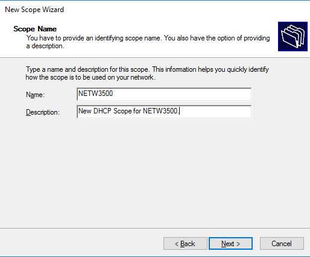
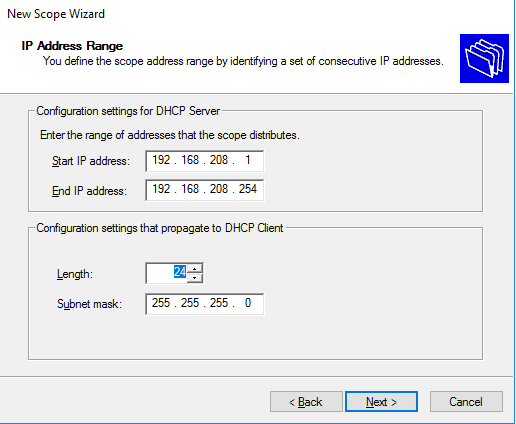
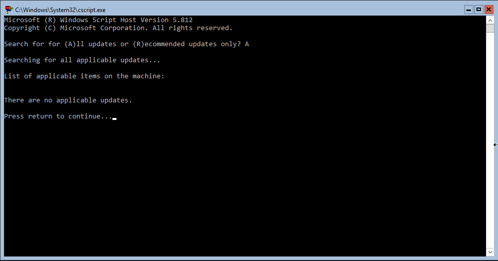
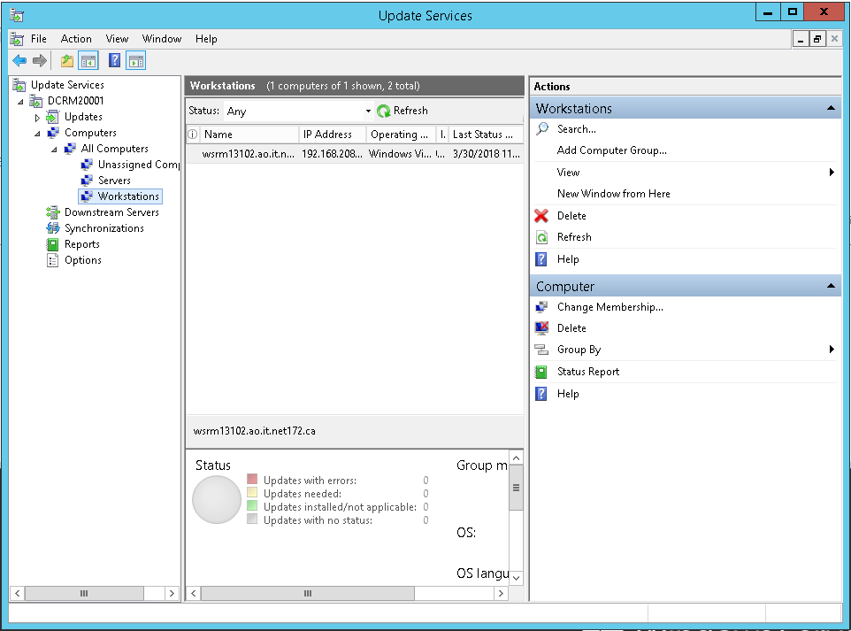
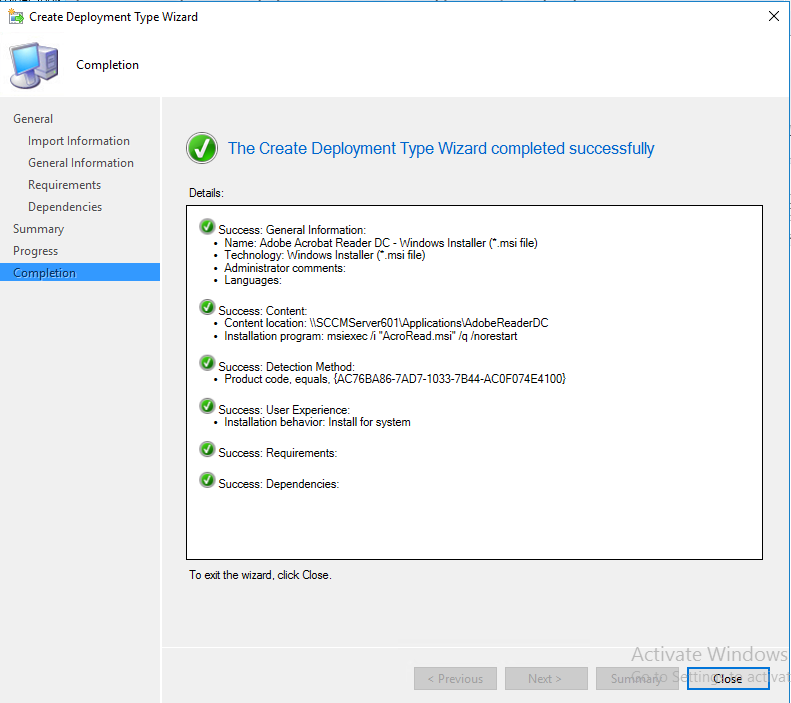
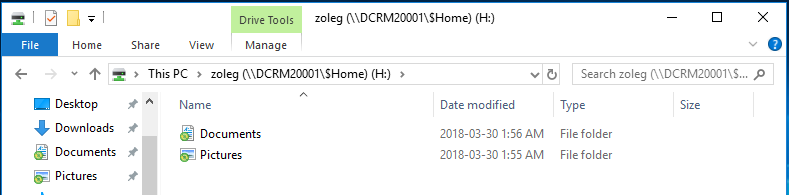
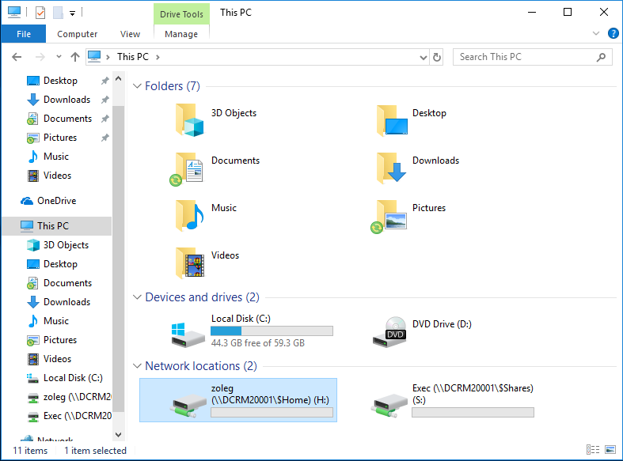

# Windows
I have worked with Windows personally since a young age, and have worked with Windows Server in an enterprise environment extensively during my time with NSCC. From Active Directory, to Group Policy, DHCP, DNS, VPN, Firewalls, SCCM, SCO, Hyper-V and WSUS. 

On this page you will find some samples of the work that I have completed thus far.

## DHCP
Throughout my time spent with NSCC, whenever we were tasked with work within the Windows environment we would frequently be required to configure our primary domain controllers for both DHCP and DNS. I picked this assignment in particular because I believe it was our first assignment introducing us to Windows Server's DHCP role.

(Creation of a new DHCP scope on a Windows Server 2016 domain controller.)

(Further details on the creation of a DHCP scope in Windows Server 2016, displaying IP range and subnet mask.)

## Windows Server 2016 Core
Though we only covered it once, during our first semester we created and configured a Windows Server 2016 R2 DataCenter Core installation for use as a file server. I liked this one as it was the final for our first Windows adminitration course and I really enjoyed working exclusively in shell.

(Image of the console of a fully-updated Server 2016 R2 Datacenter core installation, using sconfig to run updates.)

## Windows Server Update Services (WSUS)
Once during both our first and second semesters we were required to configure WSUS to deploy updates to nodes on the network. There was an issue during this assignment where I could not get all of my nodes picked up by WSUS. I'd still like to figure out what was causing this issue.

(Image of the WSUS snap-in showing available workstations to be updated.)

(A successful deployment of Adobe Reader to a node on the network using SCCM.)

## Folder redirection and drive mapping
One assignment in our first semester had us learn how to configure folder redirection and drive mapping for users within the domain using group policy. It was nice to work with environmental variables for the share mappings and it feels like so long since I've worked with group policy like in this assignment.

(Documents and pictures successfully being redirected to the users' network drive.)

(Network drive that has been automatically deployed using group policy.)
