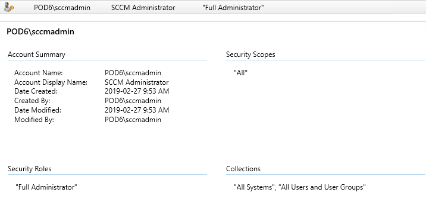

# Windows
I have worked with Windows personally since a young age, and have worked with Windows Server in an enterprise environment extensively during my time with NSCC. From Active Directory, to Group Policy, DHCP, DNS, VPN, Firewalls, SCCM, SCO, Hyper-V and WSUS. 

On this page you will find some samples of the work that I have completed thus far.

## DHCP
Throughout my time spent with NSCC, whenever we were tasked with work within the Windows environment we would frequently be required to configure our primary domain controllers for both DHCP and DNS. 

(Creation of a new DHCP scope on a Windows Server 2016 domain controller.)

(Further details on the creation of a DHCP scope in Windows Server 2016, displaying IP range and subnet mask.)

## Windows Deployment Services (WDS)
As a part of an assignment within our enterprise networking course, we were tasked with creating and deploying a sysprepped Windows 10 image to a virtual workstation over a network using WDS. We also learned how to do both attended and unattended installations.

## System Center Configuration Manager (SCCM)
During our enterprise networking course, we were required to configure a Windows Server 2016 virtual machine with SCCM. Afterwards, we used SCCM to manage computers and sites, and to deploy applications to nodes on our network.

(Summary of an SCCM installation showing the configuration used.)
 

(A successful deployment of Adobe Reader to a node on the network using SCCM.)

## Folder redirection and drive mapping
One assignment in our first semester had us learn how to configure folder redirection and drive mapping for users within the domain using group policy.

(Documents and pictures successfully being redirected to the users' network drive.)

(Network drive that has been automatically deployed using group policy.)