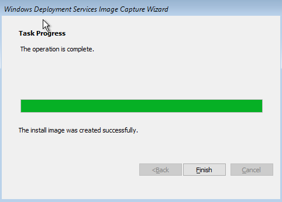

# Windows
I have worked with Windows personally since a young age, and have worked with Windows Server in an enterprise environment extensively during my time with NSCC. From Active Directory, to Group Policy, DHCP, DNS, VPN, Firewalls, SCCM, SCO, Hyper-V and WSUS. 

On this page you will find some samples of the work that I have completed thus far.

## DHCP
Throughout my time spent with NSCC, whenever we were tasked with work within the Windows environment we would frequently be required to configure our primary domain controllers for both DHCP and DNS. 

## Windows Deployment Services (WDS)
As a part of an assignment within our enterprise networking course, we were tasked with creating and deploying a sysprepped Windows 10 image to a virtual workstation over a network using WDS. We also learned how to do both attended and unattended installations.

## System Center Configuration Manager (SCCM)
During our enterprise networking course, we were required to configure a Windows Server 2016 virtual machine with SCCM. Afterwards, we used SCCM to manage computers and sites, and to deploy applications to nodes on our network.

## System Center Orchestrator (SCO)
Towards the end of our program we installed and configured SCO in order to manage users and groups within our Domain using runbooks. 

